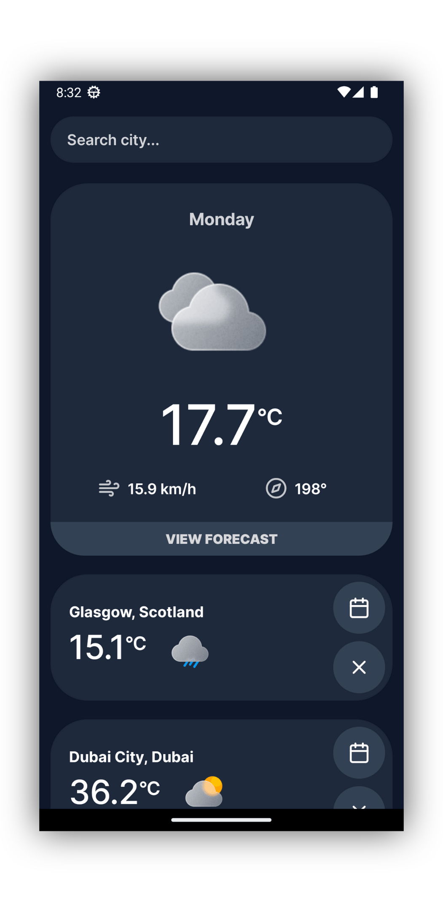
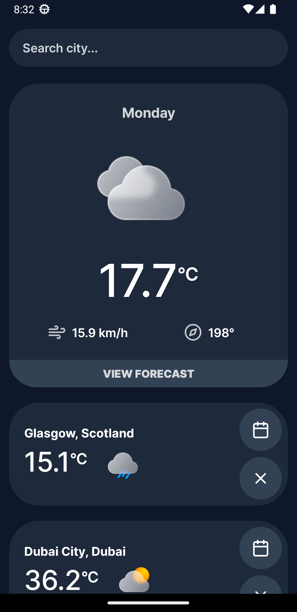
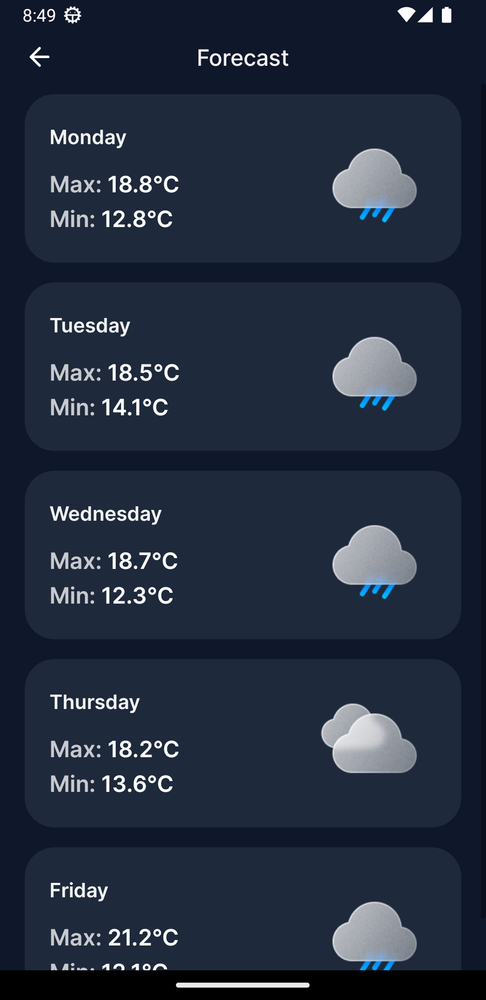
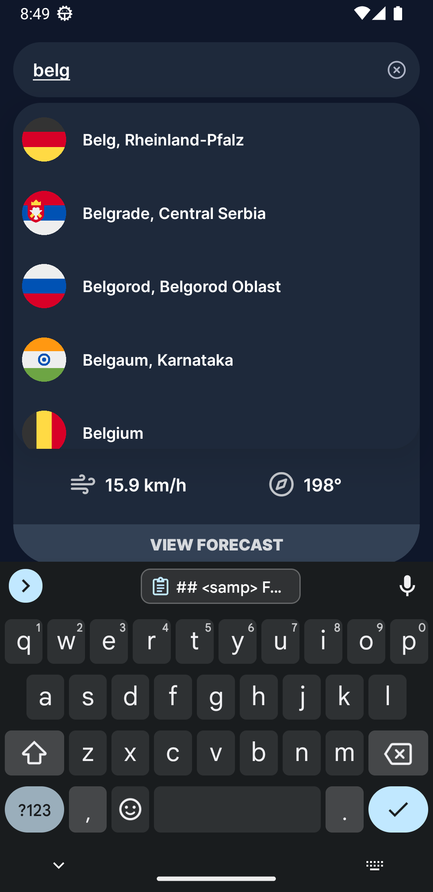
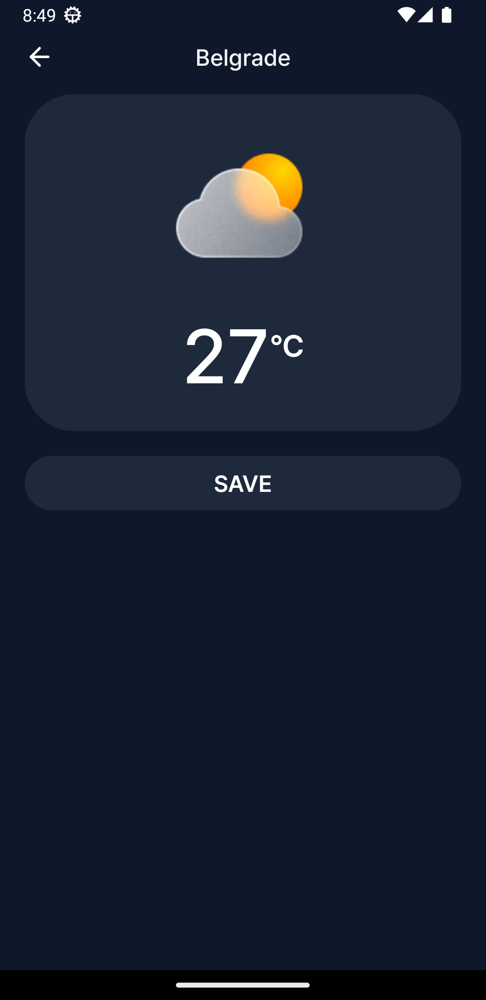
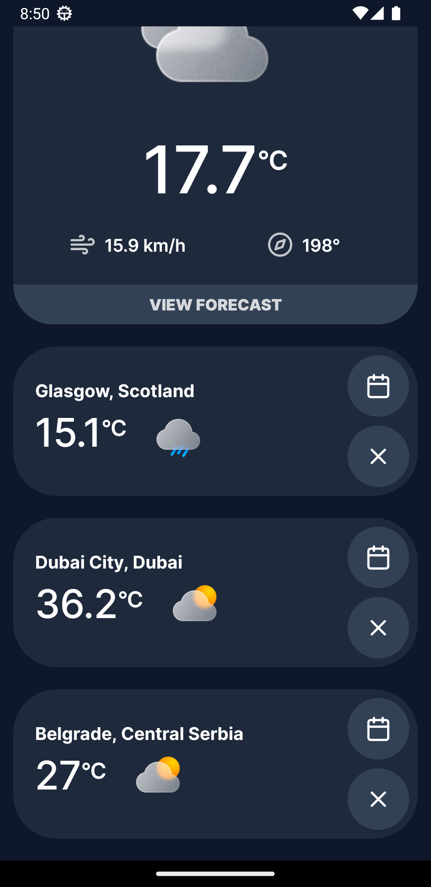

<div align="center">

```ocaml
Weather
```


<samp>Weather App powered by React Native</samp>

---
<div align="left">

> :zap: ~ This project is for Aviva

## <samp> Installation </samp>
- Releases tab _(Android only)_ 
- Build manually

## <samp> Building </samp>
Make sure to have dependancies:
```sh
node
```

I. Clone repo
```sh
git clone https://github.com/ahmedmahmud/weather_app.git
cd weather_app
```
II. Install  dependancies
```sh
npm i
```
III. Start bundler
```sh
npm start
```
IV. Follow instructions shown by the command to launch the app
- Scan QR code from phone
- Press `a/i` for simulator

## <samp> Features </samp>
- Shows weather information on current location
- Shows 5 day forcast on current location
- Allows user to search for a place and see the weather
- Allows user to save locations to always show them on home screen
- Can also check forecast of saved locations
- Saved locations persist in local storage of the app
- Swipe down to refresh

## <samp> Pictures </samp>






